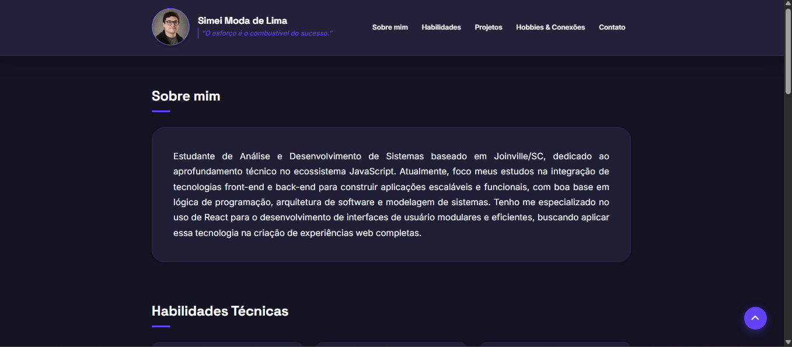
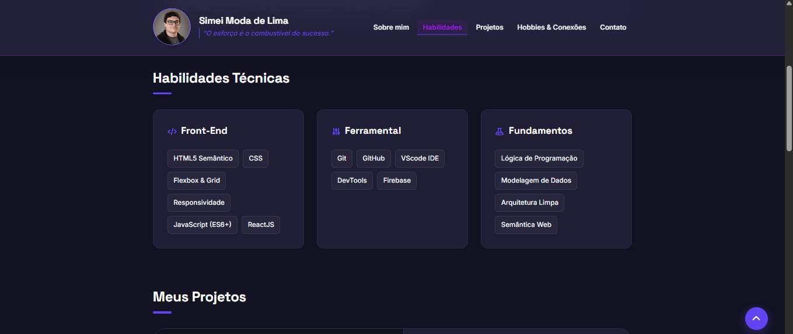

# Landing Page Pessoal

Landing page pessoal desenvolvida com HTML5 e CSS3 para apresentar meu perfil profissional, habilidades técnicas e projetos de desenvolvimento web.

## Tecnologias Utilizadas

- HTML5
- CSS3
- Flexbox
- CSS Grid
- SVG

## Funcionalidades

- Apresentação profissional
- Seção de habilidades técnicas
- Exibição de projetos
- Links para GitHub e LinkedIn
- Layout responsivo para desktop e dispositivos móveis
- Navegação interna entre seções

## Preview

### Sobre Mim

### Habilidades Técnicas

